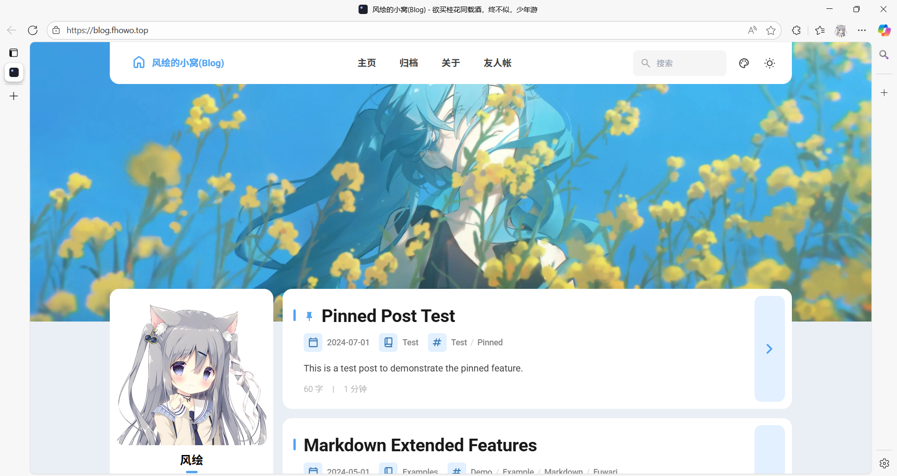

# 风绘的小窝(Blog)

一个基于[Fuwari](https://github.com/saicaca/fuwari)的静态博客。
## 声明与许可证

本仓库[风绘的小窝](https://blog.fhowo.top)的所有文章、界面（另有声明的除外）均在 [署名-非商业性使用-相同方式共享 4.0 国际 (CC BY-NC-SA 4.0)](https://creativecommons.org/licenses/by-nc-sa/4.0/deed.zh-hans) 许可协议下提供。若需转载，请注明来源（“风绘的小窝”或原文链接），且不得用于任何商业用途。

本博客Banner处插画出自Pixiv中的[紺屋/花と水飴、最終電車](https://www.pixiv.net/artworks/109275847)

## 部署

由腾讯云EdgeOne提供强力支持！

