# 准备材料

一个Github账号，Edgeone在本文有教最新获取方式，如果已经拥有Edgeone可以跳过获取教程qwq，喵喵喵～

## 获取Edgeone

获取Edgeone本教程采用的国际站目前最简单的方式，您也可以在官方Discord服务器每工作日11/12/15/18/21整点会发送兑换码每天500个，并且兑换码可以用到中国站，下面开始教程喵

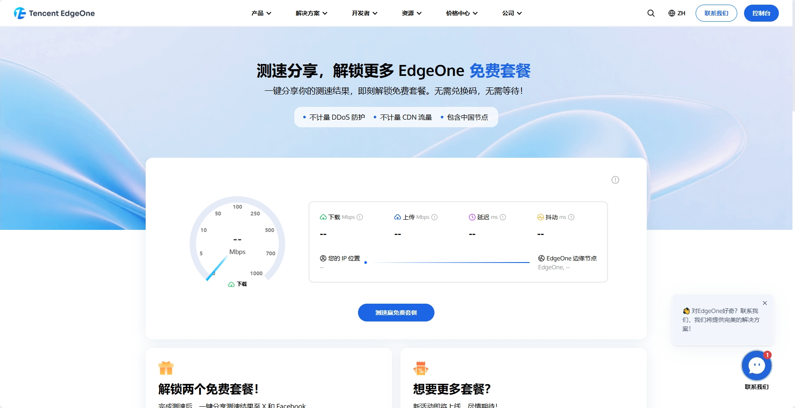
首先访问[测速分享，解锁更多 EdgeOne 免费套餐](https://edgeone.ai/zh/get-free-plan)注册登录，登录以后点击*测速赢免费套餐*，等待一分钟喵

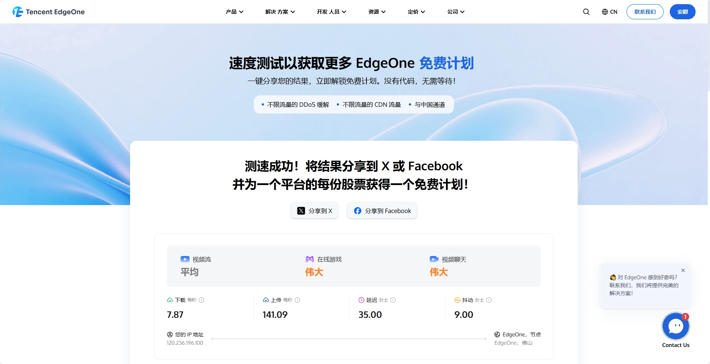
测速完成就能看到这个页面，点击分享到X以及Facebook跳转再回来就可以获取到啦，可以不分享喵

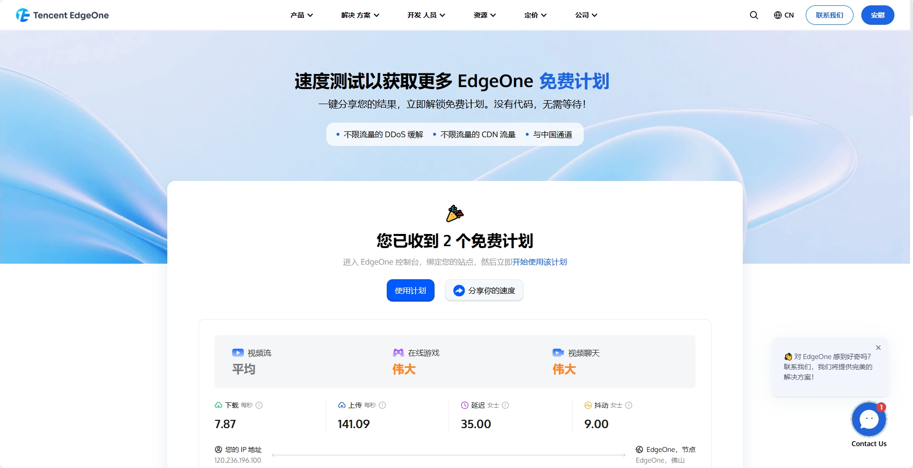
到这个页面就获取成功了喵，可以先别动进入下一段教程啦喵～

## 创建模版仓库
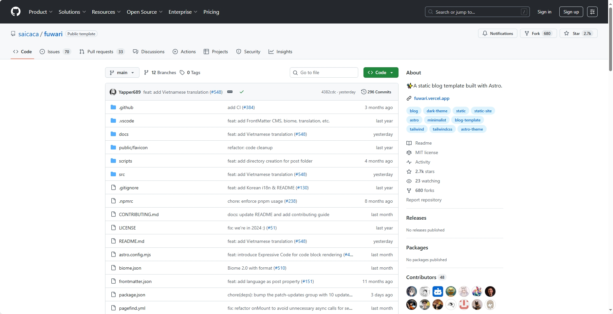
我们到Github上[Fuwari](https://github.com/saicaca/fuwari)的官方仓库，使用此仓库模版，[创建新仓库](https://github.com/new?template_name=fuwari&template_owner=saicaca)喵

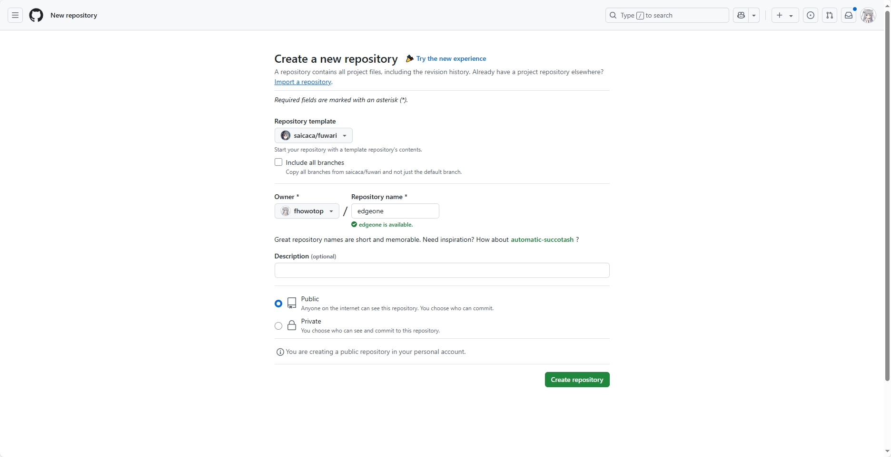
Repository name那里自定义一个喜欢的仓库名，描述选填、保持公共仓库，然后Create repository等待一会儿跳转就好了喵

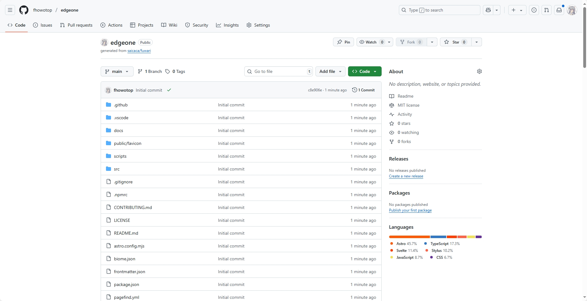
如果你有赛博强迫症可以等待仓库 *lnitial commit √* 没有就当窝没说喵，嘿嘿。

## 部署Fuwari

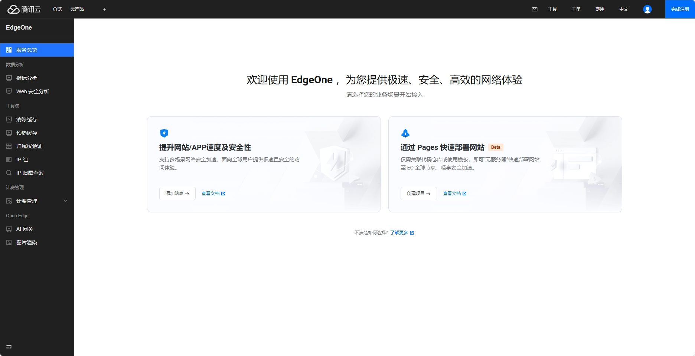
返回edgeone官网，进入右上角的*控制台*来到此页面，点击Pages*创建项目*的*通过导入Git仓库创建*喵

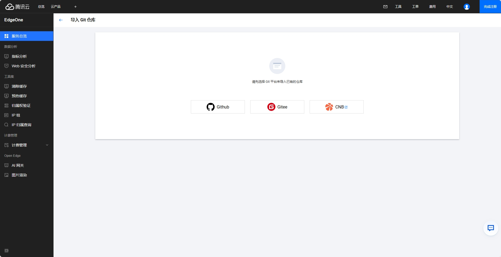
点击Github，跳转授权喵

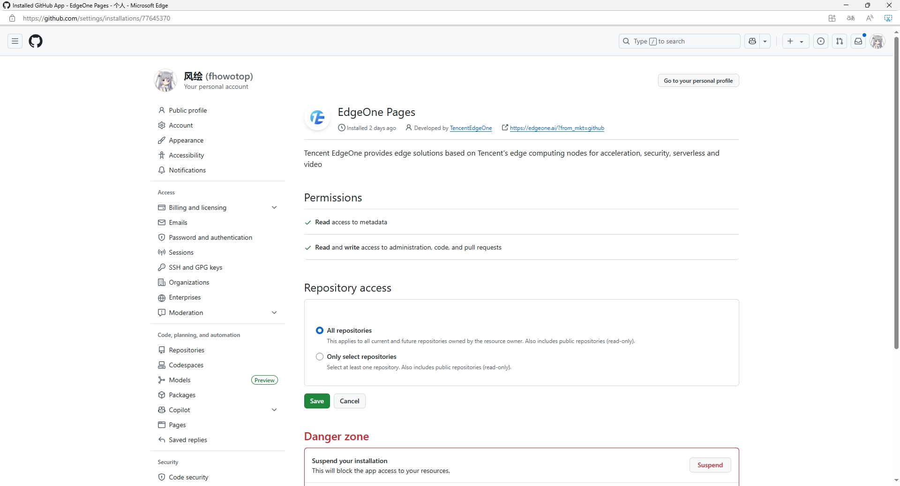
到授权页面后可选，我这里就默认所有仓库了喵，然后点击*Save*就授权好啦

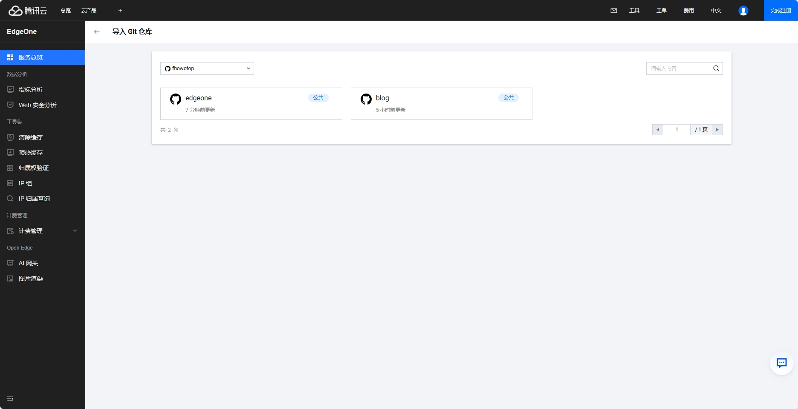
点击你刚创建模版的仓库名，然后可以进入下一段教程啦

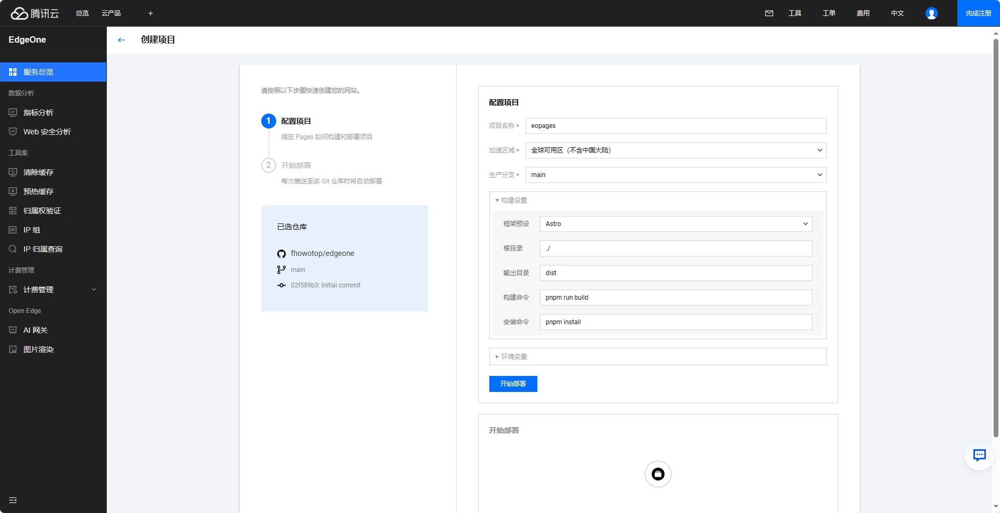
Pages名称自动用了仓库名，如果你的域名进行了*ICP备案*就选*全球可用区(含中国大陆)*反之就选不含中国大陆，不影响使用喵

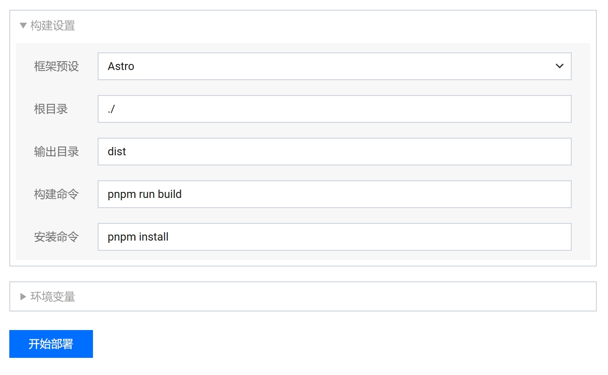
确保框架预设是Astro，命令从*npm*改为*pnpm*，然后就可以开始部署啦喵

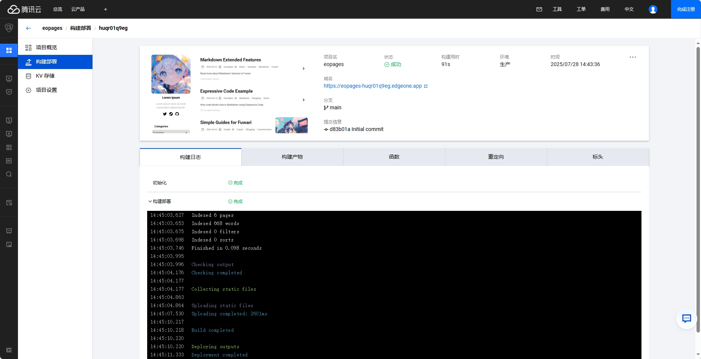
当放礼花🎉后，构建部署那里完成就好啦喵

## 自定义域名(可选)
想要自定义域名嘛，点击*项目设置*就能找到，如果你选的不含中国大陆可以直接绑定域名，如果选的含中国大陆需要[ICP备案](https://cloud.tencent.cn/document/product/243/97668)添加域名哦

> 到此就结束啦，希望这个喂饭级教程，能够帮助到您喵