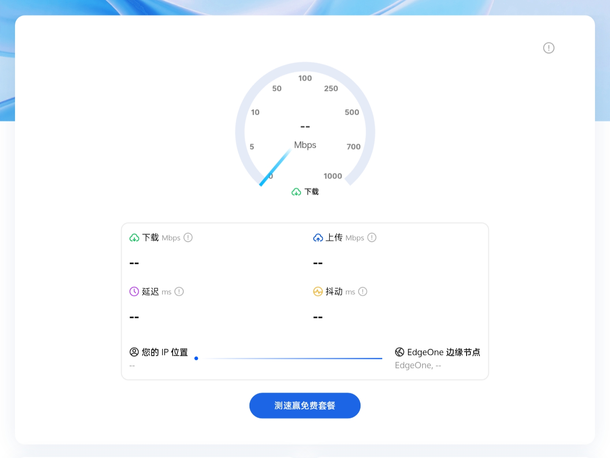
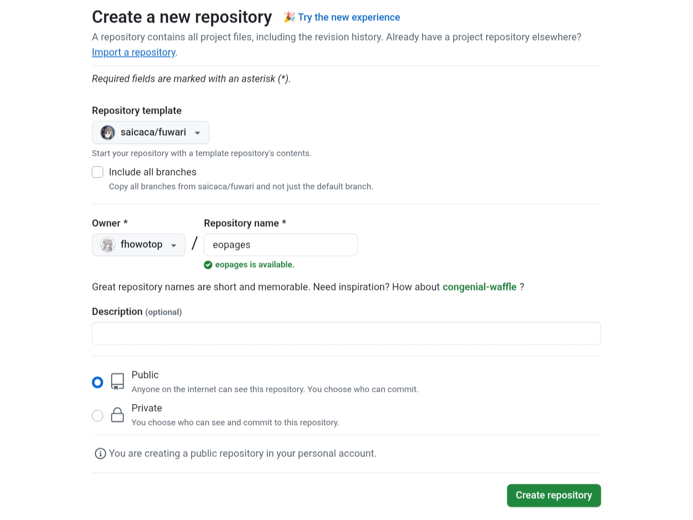
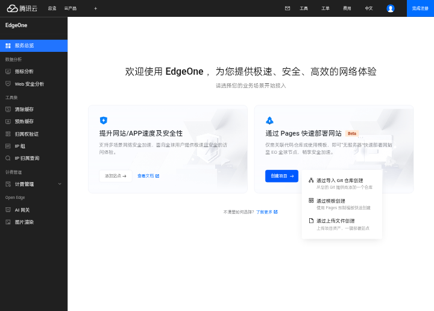
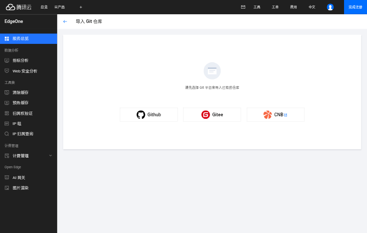
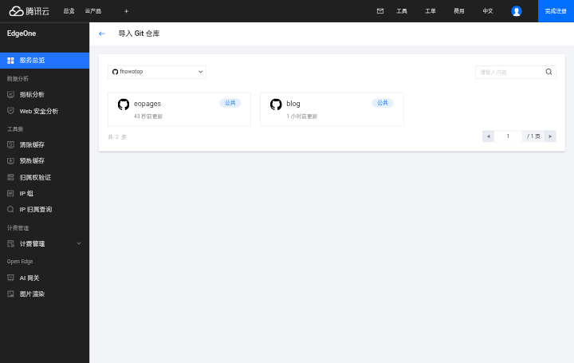
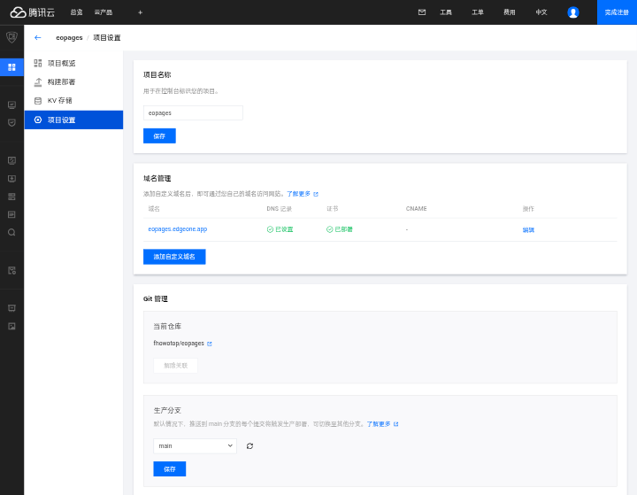

> 此教程可能对其他静态博客、文档、框架同样适用，可以参考。

# 获取Edgeone

如果您已经获取了Edgeone可跳过这一步，[Edgeone](https://edgeone.ai/zh/get-free-plan)新获取方案，登录注册后点击测速，过程一分钟，耐心等待即可喵。

出现此页面后点击分享至X或Facebook，可以点击访问后立马返回喵

这样就算获取成功啦

## 创建Fuwari仓库模板

访问Github上的[Fuwari模板](https://github.com/new?template_name=fuwari&template_owner=saicaca)，在Repository name自定义一个仓库名称，保持公共(Public)仓库，然后点击创建仓库(Create Repository)，等待你的创建完成

## 部署在Edgeone pages

创建完成后，返回Edgeone官网点击控制台，控制台选 通过Pages快速部署网站 的创建项目，点击 通过导入Git仓库创建

点击Github，同意Edgeone的请求

同意后到达此页面，点击你在Github创建的仓库名称

这里框架预设是Astro，构建命令和安装命令的*npm*改成*pnpm*，点击开始部署，部署完成就能预览进去看看了，写文章就Git或上传到你的仓库路径src/content/posts/就可以啦喵，改配置文件到 src/content/config.ts 这个路径，可以先看看网站里面的文章示例，可以帮助你快速了解Fuwari喵～

## 自定义域名

需要自定义域名就到项目设置、域名管理找一个ICP备案过的域名，不想添加备案域名可以将加速节点更换至全球加速不含中国大陆那个选项喵